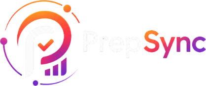
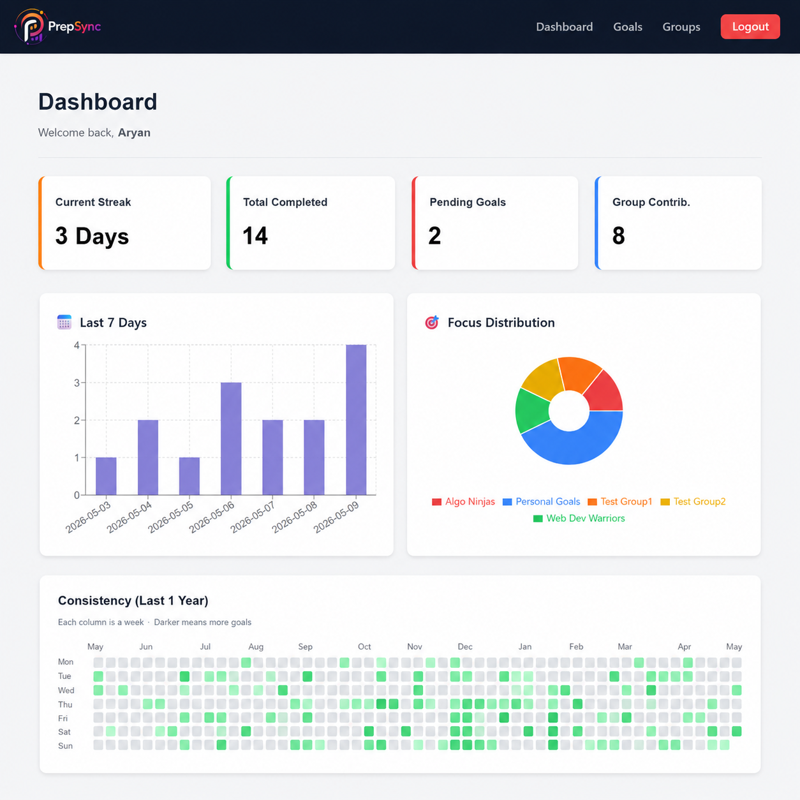

# PrepSync

<p align="center">
  
</p>

<p align="center">
  <b>Track goals. Stay consistent. Study together.</b>
</p>

<p align="center">
  PrepSync is a full-stack productivity and peer accountability platform designed for students preparing for exams, coding interviews, and academic goals.  
  The platform combines personal goal tracking with collaborative study groups, helping users maintain consistency, monitor progress, and stay accountable through analytics and shared workflows.
</p>

---

## 🌐 Try it Live:

🔗 https://prepsync-omega.vercel.app/

---

# 📸 Dashboard Preview

<p align="center">
  
</p>

The dashboard provides:
- streak tracking,
- weekly activity analytics,
- focus distribution,
- group contribution metrics,
- and yearly consistency heatmaps.

---

# ✨ Features

## 🔐 Authentication & Authorization
- JWT-based authentication
- Secure password hashing using bcrypt
- Protected routes for authenticated users
- Session persistence using React Context API

---

## 🎯 Goal Tracking System
- Create daily and weekly academic goals
- Update and delete goals
- Goal completion tracking
- Pending vs completed analytics
- Deadline validation logic

---

## 👥 Study Groups & Accountability
- Create or join study groups
- Shared collaborative preparation workflows
- Group contribution metrics
- Group-based focus tracking

---

## 📊 Productivity Analytics
- Current streak tracking
- Last 7 days activity visualization
- Focus distribution charts
- Consistency heatmap inspired by GitHub contributions
- Dashboard analytics with multiple visual components

---

## 📚 Resource Sharing
- Upload and share study resources within groups
- Cloudinary integration for secure file storage
- Shared material access for group members

---

## 🎨 User Interface
- Clean and minimal productivity-focused UI
- Responsive dashboard layout
- Interactive charts and visual analytics
- Modern dark-themed navigation system

---

# 🛠️ Tech Stack

| Category | Technologies |
|---|---|
| Frontend | React.js, CSS, Recharts |
| Backend | Node.js, Express.js |
| Database | MongoDB, Mongoose |
| Authentication | JWT, bcrypt |
| File Storage | Cloudinary |
| Deployment | Vercel (Frontend), Render (Backend) |

---

# 🧠 Why PrepSync?

Students often struggle with:
- procrastination,
- inconsistent preparation,
- lack of accountability,
- and isolated study routines.

PrepSync addresses these problems by combining:
- personal productivity tools,
- collaborative study groups,
- visual analytics,
- and consistency tracking

into a single platform built specifically for student preparation workflows.

---

# 🚀 Getting Started

## Prerequisites

Before running the project locally, make sure you have:

- Node.js installed
- MongoDB instance (local or Atlas)
- Cloudinary account

---

# 📥 Installation

## 1. Clone the Repository

```bash
git clone https://github.com/Aryangarg014/PrepSync.git
cd PrepSync
```

---

## 2. Setup Backend

```bash
cd server
npm install
```

Create a `.env` file inside the `server` directory:

```env
MONGO_URI=your_mongodb_connection_string
JWT_SECRET=your_jwt_secret
PORT=5000

CLOUDINARY_CLOUD_NAME=your_cloud_name
CLOUDINARY_API_KEY=your_api_key
CLOUDINARY_API_SECRET=your_api_secret
```

Start the backend server:

```bash
npm run dev
```

---

## 3. Setup Frontend

```bash
cd ../client
npm install
npm run dev
```

Frontend runs on:

```bash
http://localhost:5173
```

---

# 📂 Project Structure

```bash
PrepSync/
│
├── client/
│   ├── public/
│   ├── src/
│   │   ├── api/
│   │   ├── assets/
│   │   ├── components/
│   │   ├── context/
│   │   └── pages/
│
├── server/
│   ├── config/
│   ├── controllers/
│   ├── middlewares/
│   ├── models/
│   └── routes/
│
└── README.md
```

---

# 🔮 Future Improvements

- Real-time notifications using Socket.io
- Group activity feeds
- Pomodoro timer integration
- Email reminders using Cron jobs
- Improved mobile responsiveness
- Gamification with XP and badges
- Advanced group analytics
- AI-powered productivity insights

---

# 📄 License

This project is currently not licensed.